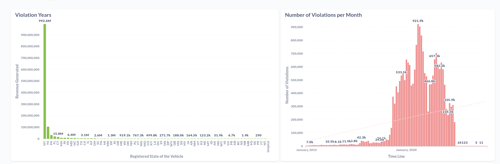

# Dataset Exploration

The **Open Parking and Camera Violations** dataset was initially loaded with all violations contained in the mainframe database as of May 2016. This Dataset is free to obtain via : [https://data.cityofnewyork.us/City-Government/Open-Parking-and-Camera-Violations/nc67-uf89](https://data.cityofnewyork.us/City-Government/Open-Parking-and-Camera-Violations/nc67-uf89)


## Architeture of the Cluster
The cluster was created with docker using the default configuration available through the RTJVM Course Spark essentials
with: `docker-compose up --scale spark-worker=3`
Check the folder spark-cluster for more Details.

And processed through spark Submit eg:
`./bin/spark-submit --class myDataset.hotspot --deploy-mode client --master spark://0d1d8e86f1ab:7077 --verbose --supervise /opt/spark-apps/spark-essentials.jar /opt/spark-data/Open_Parking_and_Camera_Violations/silver.parquet /opt/spark-data/precincts.csv`


## Reading and Defining Schema
After a simple observation and analysis of the Dataset preview, I’ve decide to make a read of the file with Spark 3.2.1


The Spark Session was defined as: 

```scala
val spark = SparkSession.builder().appName("ExploringDataset").config("spark.master","local").getOrCreate()
```

The first read was done to get a sample as:

```scala
*val DF = spark.read.options(Map("header"->"true", "sep"->",", "nullValue"->"", "inferSchema" -> true).csv(path)
DF.show(5)
Plate,State,License Type,Summons Number,Issue Date,Violation Time,Violation,Judgment Entry Date,Fine Amount,Penalty Amount,Interest Amount,Reduction Amount,Payment Amount,Amount Due,Precinct,County,Issuing Agency,Violation Status,Summons Image  
JAL2979,NY,PAS,4664359196,08/28/2019,06:56P,PHTO SCHOOL ZN SPEED VIOLATION,,50.00,0.00,0.00,0.00,50.00,0.00,000,BX,DEPARTMENT OF TRANSPORTATION,,View Summons (http://nycserv.nyc.gov/NYCServWeb/ShowImage?searchID=VGtSWk1rNUVUVEZQVkVVMVRtYzlQUT09&locationName=_____________________)*
```


## How the Dataset is processed

There is 3 Main files on the Project inside the myDataset Package.
### definitions.scala
In this file is defined the functions to generate two different types of files and the schema of the Dataset.

`generateSilverFile()`-> Transform the CSV file into a parquet file, similar to a transformation from Bronze Layer to Silver Layer,
selecting the columns that will be used in the `processor.scala`, inputing Datatypes into the Schema and replacing the 
" " to "_" in the column names.

`generateSampleData()` -> Can be used to extract a sample dataset from the CSV file.
Extracts a sample of the dataset and saves it in a parquet file. 30% of the dataset is extracted.

`generateSampleDataByYear()` -> Can be used to extract a sample dataset from the CSV file.
Has a predefined filter: `YEAR >= 2020 and YEAR <= 2022` This filter returns approximately 45% of the dataset.

Also have a function to return the main Schema to the dataset use. `schemaFile()` And a Function to return a DataFrame
with formatted desired fields to insights `fieldsDF()`

### processor.scala
The function of this method is to have the main method to execute the functions defined in the definitions.scala
Inside this method is checked if the args are correct and handling some basic exceptions (FileNotFound, NullPointer).
The desired arguments are:
- Path to the file. Eg: "/opt/spark-data/DataSet/Open_Parking_and_Camera_Violations.csv"
- Type of the file to be generated. Eg: "silver", "sample" or "year"

After seeing how the schema is predefined by the Spark itself with the option `inferSchema`, to increase the perfomance
of reading, the option schema is added to the reader and the Schema is defined with the 
types: `StringType`, `DateType` and `DoubleType` Eg: 

```scala
val violationsSchema = StructType(Array(...
StructField("State", StringType),...
StructField("Issue Date", DateType),...
StructField("Violation", StringType),...
StructField("Payment Amount", DoubleType),...
StructField("Amount Due", DoubleType),...
StructField("Issuing Agency", StringType),..
) )
```

Now the `inferSchema` can be changed to `enforceSchema` and the reading method can be correctly defined with 
the `dateFormat (”MM/dd/yyyy”)` option as viewed before. After that was possible to find a problem with the date 
column `Issue Date` described in the last part of this document.

To solve the problem with the Date column, Spark suggest the configuration bellow.
`spark.conf.set("spark.sql.legacy.timeParserPolicy", "LEGACY")`

After the first interaction it was possible to understand that the `DoubleType` wasn't able to compute 
large numbers when we have aggregation like `sum()` on `Payment Amount` by example.
So to all DataTypes that can do math operations such as `sum()` I’ve decided to change them to a
`decimalType =  DataTypes.createDecimalType(24,2)` and the result become better readable.

The output files of processor (Silver, Sample or Year) are created in the same folder as the input file.

### results.scala
Inside this file is defined the Main method that receives on the arguments the input file (PARQUET) previous generated 
by the processor method.
The desired arguments are: 
- Path to the file (PARQUET). This file can be generated with the processor method. Eg:  "/opt/spark-data/violations.parquet"
- Generate the resulting dataframes as parquet files. By default this output is disabled. Eg: "0" or "1"

### hotspot.scala
Trying to understand some patterns and finding some good Insights about the dataset, I've find on the NY Data website,
information about the precincts of the New York City. In this file we have the main method that receives two arguments:
the main Dataset file (PARQUET) and the precincts.csv file and returns the list of the Borough that have more Traffic Violations assigned.
This file will output the results from this file to a folder called Golden Layer, with the resulting dataframe saved as Parquet.

## Questions to answer with the dataset and Insights
The dataset described here was downloaded 07/29/2022 and have 83.182.274 rows.

### 1 - Identifying Outliers.
My first approach was to answer and trying to find some Insights about this data information.
But I've found that the dataset is not very clean and has some outliers that need attention.

The first finding was that we have some inaccurate data, on various Columns, for this analysis I'm pointing: `State` `Issue_Date` and `Violations`
On the `States` we have 70 Distinct `States` and  219.274 (0,26%) records from 99, 88 or Null. 
For understand why we Have 70 distincts possible States the file on [NYC Plate Types and State Codes](http://www.nyc.gov/html/dof/html/pdf/faq/stars_codes.pdf)

In the `Violation` column we have 4.717.011(5.67%) of the rows that are filled with null. But we have information about
`License_Plate`, `Issue_Date`and some of those records have information about payments `Payment_Amount`.
Is good to remember that Violations that have been written-off because they have statutorily expired and are no longer valid are indicated with blank financials.
4.712.482 (5,66%) rows match this criteria.

Lastly on the `Issue_Date` we have some dates that are Grater than Today (2022) 72.168 (0,09%) rows of the dataset.
But the majority of the information is concentrated between the years 2016 and 2022 (94,9% of the records)

I decided to keep the data even with the described issues found. Because they can be included on statistical analysis.

Except if `Plate` or `State` or `Issue_Date` are null. Only 306 Rows are removed from the dataset. (0,0004%)


## Exploring the Dataset and Insights

### 1 - How many of the records are adressed to the Government
Trying to verify how well behaved government agencies are in traffic. This query returns the number of records assigned 
only to vehicles registered as Government
As the file shown before the GV -> US Government and DP -> US State Dept.

```scala
val govStates = Array("GV", "DP")
val govDF = mainDF.where(
  upper(col("State")).isInCollection(govStates))
  .groupBy("State").agg(count("*").as("N_Records"))
  .withColumn("Percent_of_Records", ((col("N_Records") * 100L) / lit(mainDF.count())))

govDF.show(false)
+-----+---------+--------------------+
|State|N_Records|Percent_of_Records  |
+-----+---------+--------------------+
|GV   |72322    |0.08694432427951211 |
|DP   |159325   |0.19153790638855767 |
+-----+---------+--------------------+

```
We can conclude the Government have good stats, for the total of almost 0.3% of records registered.


### 2 - What are the peak times for Violations?
Using the column `Violation_Time` and doing some transformation is possible to get what was the time the violation was
generated. To preserve computation and speed on results, this transformation is handled when the silver layer is created.

```scala
val timeDF = mainDF.groupBy("Violation_Hour", "Violation_Turn", "Year").agg(
  count("Summons_Number").as("Num_Records"))

timeDF.where(col("Year") === lit(2021))
  .orderBy(col("Violation_Turn").asc_nulls_last, col("Violation_Hour").asc_nulls_last)
  .show(24, false)

+--------------+--------------+----+-----------+
|Violation_Hour|Violation_Turn|Year|Num_Records|
+--------------+--------------+----+-----------+
|00:00 - 00:59 |AM            |2021|51956      |
|01:00 - 01:59 |AM            |2021|86185      |
|02:00 - 02:59 |AM            |2021|64801      |
|03:00 - 03:59 |AM            |2021|33978      |
|04:00 - 04:59 |AM            |2021|22784      |
|05:00 - 05:59 |AM            |2021|116578     |
|06:00 - 06:59 |AM            |2021|582214     |
|07:00 - 07:59 |AM            |2021|997458     |
|08:00 - 08:59 |AM            |2021|1419028    |
|09:00 - 09:59 |AM            |2021|1347231    |
|10:00 - 10:59 |AM            |2021|1142956    |
|11:00 - 11:59 |AM            |2021|1339529    |
|12:00 - 12:59 |AM            |2021|24952      |
|00:00 - 00:59 |PM            |2021|107        |
|01:00 - 01:59 |PM            |2021|1320096    |
|02:00 - 02:59 |PM            |2021|1158055    |
|03:00 - 03:59 |PM            |2021|917462     |
|04:00 - 04:59 |PM            |2021|742791     |
|05:00 - 05:59 |PM            |2021|594501     |
|06:00 - 06:59 |PM            |2021|455204     |
|07:00 - 07:59 |PM            |2021|348116     |
|08:00 - 08:59 |PM            |2021|389265     |
|09:00 - 09:59 |PM            |2021|364930     |
|10:00 - 10:59 |PM            |2021|87679      |
|11:00 - 11:59 |PM            |2021|58861      |
|12:00 - 12:59 |PM            |2021|1242819    |
|null          |null          |2021|222        |
+--------------+--------------+----+-----------+
```
It is possible to Identify the peak of Cars and Violations in 2021 that has been after 7:00 AM.
In comparison with 6:00 AM we have an increase of almost 71%.
And again if we compare 8:00 AM to 07:00 we have an increase of almost 40%.
Should be more interesting redirect police or transit officers to decrease these stats?


### 3 - Identifying which state have most violations. Comparing what was issued and what was converted into revenue by the state.

To this case I’ve decided creating two different `DataFrames` and joining them after in `outer` mode.
The first one have data about violations that have been payed and the second one have data about violations that have open
values.


```scala
val payStateDF = mainDF.select(col("State"), col("Payment_Amount"))
  .where("Payment_Amount > 0").groupBy("State").agg(
  count("State").as("N_Records"),
  sum("Payment_Amount").as("Total_Received"),
  round(avg("Payment_Amount"), 2).as("Average_Received")
)
//Open tickets
val dueStateDF = mainDF.select(col("State"), col("Amount_Due"))
  .where("Amount_Due > 0").groupBy("State").agg(
  count("State").as("N_Due_Records"),
  sum("Amount_Due").as("Total_Amount_Due"),
  round(avg("Amount_Due"), 2).as("Average_Amount_Due")
).withColumnRenamed("State", "Due_State")

val payVsDueDF = payStateDF
  .join(dueStateDF, payStateDF.col("State") === dueStateDF.col("Due_State")
    , "outer").drop("Due_State").orderBy(col("Total_Received").desc)
payVsDueDF.show(5)

+-----+---------+--------------------+----------------+-------------+--------------------+------------------+
|State|N_Records|      Total_Received|Average_Received|N_Due_Records|    Total_Amount_Due|Average_Amount_Due|
+-----+---------+--------------------+----------------+-------------+--------------------+------------------+
|   NY| 50658809|       3783640755.75|           74.69|      6083304|        728208657.80|            119.71|
|   NJ|  4852089|        403657197.54|           83.19|      1473357|        170298682.15|            115.59|
|   PA|  1418728|        115472176.26|           81.39|       712249|         88369878.27|            124.07|
|   FL|   882025|         66985972.60|           75.95|       293229|         35268387.83|            120.28|
|   CT|   763165|         60525800.78|           79.31|       268196|         30647657.74|            114.27|
+-----+---------+--------------------+----------------+-------------+--------------------+------------------+


```

After joining them was possible to see that the state with the highest revenue was `NY` with a total of 3.783.640.755,75.
But surprising was that Florida, wich is 1.219 Miles away, is on 4th place and generated 6.6985.972,60 of revenue.
Imagine traveling just to get Violations.


### 4 - Was the average ticket price higher or lower than the average ticket price in the state with the highest revenue?

```scala
val avgDF = violationsDF.select(
    round(mean("Payment_Amount"),2).as("Mean_Ticket"),
    round(stddev("Payment_Amount"),2).as("STD_Ticket")  )
avgDF.show(false)
+-----------+----------+
|Mean_Ticket|STD_Ticket|
+-----------+----------+
|70.67      |30.12     |
+-----------+----------+

```
The standard deviation shows the data are aggregated closer to the mean.
But the mean ticket that has been payed is lower than the average of the value that has been pay by state.
The difference is almost 10% a very good indicative that people are willing to pay their obligations.


### 5 - What is the most commom violation in the recent years?
For this case I choosed to understand what Violations are being payed by the users.
```scala
val violationYearDF = mainDF.where("Payment_Amount > 0").groupBy("Year", "Issuing_Agency", "Violation")
  .agg(count("Violation").as("N_Violations"))
  .orderBy(col("N_Violations").desc)

violationYearDF.show(5, false)

+----+----------------------------+------------------------------+------------+
|Year|Issuing_Agency              |Violation                     |N_Violations|
+----+----------------------------+------------------------------+------------+
|2020|DEPARTMENT OF TRANSPORTATION|PHTO SCHOOL ZN SPEED VIOLATION|4071406     |
|2021|DEPARTMENT OF TRANSPORTATION|PHTO SCHOOL ZN SPEED VIOLATION|3933959     |
|2019|DEPARTMENT OF TRANSPORTATION|PHTO SCHOOL ZN SPEED VIOLATION|2194403     |
|2022|DEPARTMENT OF TRANSPORTATION|PHTO SCHOOL ZN SPEED VIOLATION|1762874     |
|2018|TRAFFIC                     |NO PARKING-STREET CLEANING    |1268699     |
+----+----------------------------+------------------------------+------------+

```
The most commom violation issued is *`PHTO SCHOOL ZN SPEED VIOLATION`* 
and from 2019 to 2020 it almost doubled the number of Violations. But on the next year the value didn't decrease or 
increase considerably.

Wich shows that School Zones are becoming hotspots of speeding violations.


### 6 - How the violations are evolving Day by Day on the same year?
In this case I Decided to analyze the data by day. Creating a dataframe that has the Average of violations per DayOfWeek 
by Year and doing a comparison to the year by this DayOfWeek.

```scala
// Trying to identify Outliers and discovery wich days/months are inside the mean of the year
      val viTimesDF = mainDF.select("Issue_Date", "Summons_Number", "Month", "Day", "Year")
        .withColumn("Week", weekofyear(col("Issue_Date")))
        .withColumn("DayOfWeek", dayofweek(col("Issue_Date")))


      // AVG of Tickets per Day of week by Year
      val viDayWeekYearDF = viTimesDF.groupBy("Year", "DayOfWeek").agg(
        count("Summons_Number").as("Total_Violations_Day")
      ).withColumn("AVG_Violations_Day", (col("Total_Violations_Day") / 52.1429).cast(DecimalType(18, 2)))

      // Tickets per Days, weeks and months
      val countDF = viTimesDF.groupBy("Year", "Month", "Week", "DayOfWeek", "Issue_Date").agg(
        count("Summons_Number").as("N_Violations")
      )

      // Now we can compare the AVG vs Number by day of week
      val condition = ((countDF.col("Year") === viDayWeekYearDF.col("Year"))
        and (countDF.col("DayOfWeek") === viDayWeekYearDF.col("DayOfWeek")))
      val joinedDF = countDF.alias("count").join(viDayWeekYearDF.alias("totals"), condition, "inner")
        .select("count.Year", "count.Month", "count.Week", "count.DayOfWeek", "count.Issue_Date", "count.N_Violations", "totals.Total_Violations_Day", "totals.AVG_Violations_Day")
        .withColumn("Variation_Percent",
          round((((countDF.col("N_Violations") * 100L) / viDayWeekYearDF.col("AVG_Violations_Day")) - 100L), 4))
        .orderBy(col("Issue_Date").asc)

      joinedDF.show(50, false)
      joinedDF.where(col("Year") === lit(2021)).show(92, false)
```
The main result of this transformation contains data from all Years but doing a deep analysis on the year 2021
is possible to see some months have a reduction on violations. Like the 02/2021 having maximum -90% Registered violations
in comparison to the average of the year. After this first week of February the number of violations is slowly increasing 
until gets back to the average on the March/2021.

On wednesdays we have less variation, goint from +15% of the average until getting -72% of the average.
where the others have a more variation of days.

The day that have more variation above the average is a Monday (08/02/2021) with 29.02%.
And the day with less violations is not the first day of the year but the first day of the second month.
02/01/2021 have registered only 564 Violations. 98.7% less of the average of the same day of week.

This was caused due to an Historical Snowstorm (Winter Storm Orlena) that hit the state.  
Besides that the first and last day of the year are top records on reduction of violations.

```scala
+----+-----+----+---------+----------+------------+--------------------+------------------+-----------------+
|Year|Month|Week|DayOfWeek|Issue_Date|N_Violations|Total_Violations_Day|AVG_Violations_Day|Variation_Percent|
+----+-----+----+---------+----------+------------+--------------------+------------------+-----------------+
|2021|1    |53  |6        |2021-01-01|3326        |2793181             |53567.81          |-93.7910         |
|2021|1    |53  |7        |2021-01-02|19688       |1121383             |21505.96          |-8.4533          |
|2021|1    |53  |1        |2021-01-03|7394        |440623              |8450.30           |-12.5001         |
|2021|1    |1   |2        |2021-01-04|52439       |2374248             |45533.49          |15.1658          |
|2021|1    |1   |3        |2021-01-05|56303       |2701964             |51818.45          |8.6543           |
|2021|1    |1   |4        |2021-01-06|54434       |2691523             |51618.21          |5.4550           |
|2021|1    |1   |5        |2021-01-07|61181       |2786821             |53445.84          |14.4729          |
|2021|1    |1   |6        |2021-01-08|60184       |2793181             |53567.81          |12.3511          |
|2021|1    |1   |7        |2021-01-09|22141       |1121383             |21505.96          |2.9529           |
|2021|1    |1   |1        |2021-01-10|8457        |440623              |8450.30           |0.0793           |
|2021|1    |2   |2        |2021-01-11|52593       |2374248             |45533.49          |15.5040          |
|2021|1    |2   |3        |2021-01-12|55276       |2701964             |51818.45          |6.6724           |
|2021|1    |2   |4        |2021-01-13|55101       |2691523             |51618.21          |6.7472           |
|2021|1    |2   |5        |2021-01-14|60565       |2786821             |53445.84          |13.3203          |
|2021|1    |2   |6        |2021-01-15|57721       |2793181             |53567.81          |7.7531           |
|2021|1    |2   |7        |2021-01-16|22502       |1121383             |21505.96          |4.6315           |
|2021|1    |2   |1        |2021-01-17|8255        |440623              |8450.30           |-2.3112          |
|2021|1    |3   |2        |2021-01-18|44166       |2374248             |45533.49          |-3.0033          |
|2021|1    |3   |3        |2021-01-19|55606       |2701964             |51818.45          |7.3093           |
|2021|1    |3   |4        |2021-01-20|52465       |2691523             |51618.21          |1.6405           |
|2021|1    |3   |5        |2021-01-21|60998       |2786821             |53445.84          |14.1305          |
|2021|1    |3   |6        |2021-01-22|60522       |2793181             |53567.81          |12.9820          |
|2021|1    |3   |7        |2021-01-23|22314       |1121383             |21505.96          |3.7573           |
|2021|1    |3   |1        |2021-01-24|8337        |440623              |8450.30           |-1.3408          |
|2021|1    |4   |2        |2021-01-25|52487       |2374248             |45533.49          |15.2712          |
|2021|1    |4   |3        |2021-01-26|41838       |2701964             |51818.45          |-19.2604         |
|2021|1    |4   |4        |2021-01-27|52762       |2691523             |51618.21          |2.2159           |
|2021|1    |4   |5        |2021-01-28|58359       |2786821             |53445.84          |9.1928           |
|2021|1    |4   |6        |2021-01-29|50659       |2793181             |53567.81          |-5.4301          |
|2021|1    |4   |7        |2021-01-30|21719       |1121383             |21505.96          |0.9906           |
|2021|1    |4   |1        |2021-01-31|8224        |440623              |8450.30           |-2.6780          |
|2021|2    |5   |2        |2021-02-01|564         |2374248             |45533.49          |-98.7614         |
|2021|2    |5   |3        |2021-02-02|4717        |2701964             |51818.45          |-90.8971         |
|2021|2    |5   |4        |2021-02-03|13977       |2691523             |51618.21          |-72.9223         |
|2021|2    |5   |5        |2021-02-04|19075       |2786821             |53445.84          |-64.3097         |
|2021|2    |5   |6        |2021-02-05|22408       |2793181             |53567.81          |-58.1689         |
|2021|2    |5   |7        |2021-02-06|11442       |1121383             |21505.96          |-46.7961         |
|2021|2    |5   |1        |2021-02-07|2349        |440623              |8450.30           |-72.2022         |
|2021|2    |6   |2        |2021-02-08|24921       |2374248             |45533.49          |-45.2689         |
|2021|2    |6   |3        |2021-02-09|30733       |2701964             |51818.45          |-40.6910         |
|2021|2    |6   |4        |2021-02-10|37461       |2691523             |51618.21          |-27.4268         |
|2021|2    |6   |5        |2021-02-11|28864       |2786821             |53445.84          |-45.9939         |
|2021|2    |6   |6        |2021-02-12|38807       |2793181             |53567.81          |-27.5554         |
|2021|2    |6   |7        |2021-02-13|18004       |1121383             |21505.96          |-16.2837         |
|2021|2    |6   |1        |2021-02-14|6683        |440623              |8450.30           |-20.9141         |
|2021|2    |7   |2        |2021-02-15|36740       |2374248             |45533.49          |-19.3121         |
|2021|2    |7   |3        |2021-02-16|51127       |2701964             |51818.45          |-1.3344          |
|2021|2    |7   |4        |2021-02-17|47331       |2691523             |51618.21          |-8.3056          |
|2021|2    |7   |5        |2021-02-18|8332        |2786821             |53445.84          |-84.4104         |
|2021|2    |7   |6        |2021-02-19|16472       |2793181             |53567.81          |-69.2502         |
|2021|2    |7   |7        |2021-02-20|14173       |1121383             |21505.96          |-34.0973         |
|2021|2    |7   |1        |2021-02-21|6660        |440623              |8450.30           |-21.1862         |
|2021|2    |8   |2        |2021-02-22|34320       |2374248             |45533.49          |-24.6269         |
|2021|2    |8   |3        |2021-02-23|51329       |2701964             |51818.45          |-0.9445          |
|2021|2    |8   |4        |2021-02-24|53133       |2691523             |51618.21          |2.9346           |
|2021|2    |8   |5        |2021-02-25|57970       |2786821             |53445.84          |8.4649           |
|2021|2    |8   |6        |2021-02-26|48073       |2793181             |53567.81          |-10.2577         |
|2021|2    |8   |7        |2021-02-27|19824       |1121383             |21505.96          |-7.8209          |
|2021|2    |8   |1        |2021-02-28|7982        |440623              |8450.30           |-5.5418          |
|2021|3    |9   |2        |2021-03-01|48756       |2374248             |45533.49          |7.0772           |
|2021|3    |9   |3        |2021-03-02|52257       |2701964             |51818.45          |0.8463           |
|2021|3    |9   |4        |2021-03-03|55452       |2691523             |51618.21          |7.4272           |
|2021|3    |9   |5        |2021-03-04|58755       |2786821             |53445.84          |9.9337           |
|2021|3    |9   |6        |2021-03-05|56114       |2793181             |53567.81          |4.7532           |
|2021|3    |9   |7        |2021-03-06|23203       |1121383             |21505.96          |7.8910           |
|2021|3    |9   |1        |2021-03-07|9315        |440623              |8450.30           |10.2328          |
|2021|3    |10  |2        |2021-03-08|49399       |2374248             |45533.49          |8.4894           |
|2021|3    |10  |3        |2021-03-09|55255       |2701964             |51818.45          |6.6319           |
|2021|3    |10  |4        |2021-03-10|55325       |2691523             |51618.21          |7.1812           |
|2021|3    |10  |5        |2021-03-11|60128       |2786821             |53445.84          |12.5027          |
|2021|3    |10  |6        |2021-03-12|58796       |2793181             |53567.81          |9.7599           |
|2021|3    |10  |7        |2021-03-13|23875       |1121383             |21505.96          |11.0157          |
|2021|3    |10  |1        |2021-03-14|9025        |440623              |8450.30           |6.8009           |
|2021|3    |11  |2        |2021-03-15|48704       |2374248             |45533.49          |6.9630           |
|2021|3    |11  |3        |2021-03-16|51361       |2701964             |51818.45          |-0.8828          |
|2021|3    |11  |4        |2021-03-17|53783       |2691523             |51618.21          |4.1938           |
|2021|3    |11  |5        |2021-03-18|43241       |2786821             |53445.84          |-19.0938         |
|2021|3    |11  |6        |2021-03-19|57884       |2793181             |53567.81          |8.0574           |
|2021|3    |11  |7        |2021-03-20|24094       |1121383             |21505.96          |12.0341          |
|2021|3    |11  |1        |2021-03-21|9295        |440623              |8450.30           |9.9961           |
|2021|3    |12  |2        |2021-03-22|51880       |2374248             |45533.49          |13.9381          |
|2021|3    |12  |3        |2021-03-23|54253       |2701964             |51818.45          |4.6982           |
|2021|3    |12  |4        |2021-03-24|47321       |2691523             |51618.21          |-8.3250          |
|2021|3    |12  |5        |2021-03-25|58435       |2786821             |53445.84          |9.3350           |
|2021|3    |12  |6        |2021-03-26|58366       |2793181             |53567.81          |8.9572           |
|2021|3    |12  |7        |2021-03-27|24319       |1121383             |21505.96          |13.0803          |
|2021|3    |12  |1        |2021-03-28|7652        |440623              |8450.30           |-9.4470          |
|2021|3    |13  |2        |2021-03-29|48389       |2374248             |45533.49          |6.2712           |
|2021|3    |13  |3        |2021-03-30|56374       |2701964             |51818.45          |8.7914           |
|2021|3    |13  |4        |2021-03-31|51101       |2691523             |51618.21          |-1.0020
```

### 7 - Is the revenue generated by payed tickets increasing?
The granularity of this data is by month and year.
```scala
val yearVsMonthDF = mainDF.withColumn("Year_Month",
  concat(col("Month"), lit('/'), col("Year")))
  .groupBy("Year_Month").agg(
  count("Year_Month").as("N_Violations"),
  sum(col("Fine_Amount").cast(decimalType)).as("Total_Fine"),
  sum(col("Payment_Amount").cast(decimalType)).as("Total_Received"),
  sum(col("Amount_Due")).cast(decimalType).as("Total_Amount_Due")
).orderBy(col("N_Violations").desc)

yearVsMonthDF.show(false)
+----------+------------+------------+--------------+----------------+
|Year_Month|N_Violations|Total_Fine  |Total_Received|Total_Amount_Due|
+----------+------------+------------+--------------+----------------+
|9/2020    |1446034     |103727000.00|79077806.99   |25617156.87     | 
|6/2021    |1434545     |102205258.00|77242330.38   |32038085.38     |
|8/2021    |1410945     |98024288.00 |75381863.76   |31573151.03     |
|10/2020   |1410763     |103084147.00|76830263.39   |27249306.49     |
|6/2022    |1402298     |98336461.00 |42859993.94   |56195807.06     |
|7/2021    |1395354     |96568560.00 |74272927.96   |30185225.85     |
|8/2020    |1394521     |97124320.00 |76256973.81   |22793586.39     |
|3/2022    |1381636     |98073903.00 |68879929.25   |40972471.26     |
|3/2021    |1362107     |97938489.00 |73455629.70   |29904575.89     |
|5/2022    |1339662     |94715495.00 |54769824.11   |46835562.86     |
|10/2021   |1337163     |94653574.00 |72342951.25   |31339683.60     |
|4/2022    |1322381     |93234738.00 |61823873.39   |41870219.59     |
|8/2019    |1321980     |89205587.00 |82130450.19   |13777801.10     |
|11/2021   |1277392     |89193341.00 |69083105.53   |29033810.05     |
|10/2019   |1266006     |89290165.00 |79838986.17   |14522269.79     |
|11/2020   |1256245     |91383960.00 |67966539.71   |24787068.22     |
|1/2021    |1248016     |88135735.00 |67086629.53   |25937975.32     |
|9/2019    |1220316     |85014748.00 |77408784.77   |13416269.74     |
|4/2021    |1200004     |85313472.00 |64734533.19   |26479903.38     |
|5/2021    |1190596     |85048103.00 |64165961.37   |26974822.55     |
+----------+------------+------------+--------------+----------------+
```
Is possible to see that the month of June to September is where we have the most common violations.
And the revenue generated by payed tickets is decreasing.
As we can see the months of 2022 have almost half of tickets in open.

### 8 - Which Precinct/Borough are Top of Occurrences?
For this case I've needed to create manually the precincts.csv file that contains
The PrecinctName, Code and Information of all the precincts in New York.
To get this results use the hotspot.scala method.
This requires two args, the first one is the parquet file (Silver), and second one is the location
of the precincts.csv file.
This file can be found inside the folder: `src/main/resources/data

```scala
val condition = (mainDF.col("Precinct") === precinctDF.col("PrecinctNumber"))
val hotSpotDF = mainDF.join(precinctDF, condition, "inner")
        .groupBy("Year", "PrecinctName", "Borough")
        .agg(count("*").alias("N_Occurrences"))
        .orderBy(col("N_Occurrences").desc_nulls_last)

hotSpotDF.show(50,false)
+----+--------------+---------+-------------+
|Year|PrecinctName  |Borough  |N_Occurrences|
+----+--------------+---------+-------------+
|2019|19th Precinct |Manhattan|500219       |
|2017|19th Precinct |Manhattan|432356       |
|2021|19th Precinct |Manhattan|424252       |
|2018|19th Precinct |Manhattan|410730       |
|2020|19th Precinct |Manhattan|365984       |
|2021|114th Precinct|Queens   |364815       |
|2019|13th Precinct |Manhattan|350601       |

```
As we can see the 19th Precinct inside Manhattan is the leader of Occurrences of violations.
And every year the numbers are closer. 
If we see the difference in the same year, for the second precinct in the queens, that have a reduction of almost 15% 
is possible to obtain some education for the users and reduce the amount of violations?


# Transformation of the results to Golden Layer
The `results.scala method have a second parameter if the users send a "1" the method gonna create for every 
Dataframe shown here an parquet file with the results.
For the hotspot file this is auto.

For better understanding I've created External Tables inside the spark-sql bash.
```bash
spark-sql> show tables;
results_avg_per_day
results_gov
results_pay_due
results_stats
results_time
results_violation_year
results_violations_year_month
silver_main
Time taken: 0.025 seconds, Fetched 8 row(s)
```


## Problems found

### Problem 1

The first problem found was regarding the Spark’s delay to process the DataSet.

The Spark session was set to local with only 1 core and 1Gb of Ram to process everything, when the Scala Object was executed, the Spark understood that it was needed to read the entire CSV file to each operation that we did to answer the questions. The average time to execute the entire code was 50 Minutes

The cause of that was **Wide Transformations** that we were executing in the code, such as **Joins, filters, aggs.** Trying to solve that I’ve setup an local cluster with Docker with 3 workers and tried to increase the perfomance. I’ve been able to generate the JAR of the project and tried to run the class via spark-submit, but the perfomance didn’t increase too much. The average time to execute the spark-submit was 40 minutes.

After that I’ve tried to do some configuration with the Main Dataframe and the best approach I found to reduce costs of that it was creating a intermediate DataFrame selecting the fields that we need to answer those questions above, and doing a `repartition()` to increase the perfomance.

Finally what worked was the combination of `Coalesce()` and `Persist()`. The **coalesce()** reduce the number of partitions and the **persist()** maintain the data by default in`MEMORY_AND_DISK` . The average time to execute the code after that was 5 minutes.

```scala
val aggDF = violationsDF.selectExpr(
  "State",
  "`Issue Date`",
  "Violation",
  "`Payment Amount`",
  "`Amount Due`",
  "`Issuing Agency`" )
.coalesce(20).persist()
```

Later this method become inefficient and the functions inside `definitions.scala` were defined,
this file generates a silver staged Parquet file that increases by far the perfomance.

### Problem 2

The second problem found was: Incorrect Data in the field `Issue Date` Some rows have impossibles dates to convert such as: `Summons Number = *1464546344` that shows `11/31/2020` or* *`1459704782` that shows the date `11/31/2019`*

Two direct solutions can be achieved by doing a configuration in the SparkSession

`spark.conf.set("spark.sql.legacy.timeParserPolicy", "CORRECTED")` OR

`spark.conf.set("spark.sql.legacy.timeParserPolicy", "LEGACY")`

The first one sets the incorrect date in columm to NULL and puts all the data information regards the row in a column by default: `_corrupt_record` that also need to be declared in the schema

The second sets the incorrect date to an correct date, the next valid date. 11/31/2020 → 12/01/2020 and the second from 11/31/2019 → 12/01/2019.




